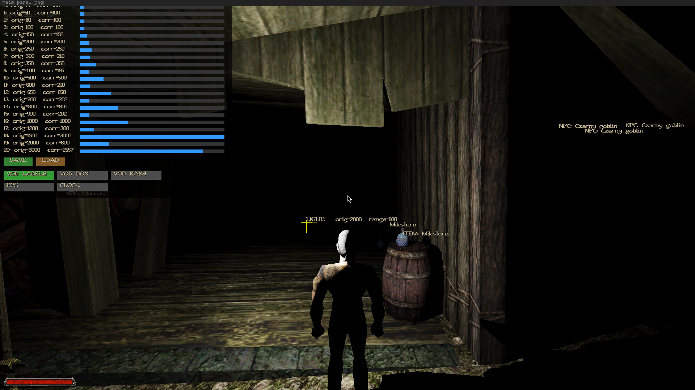

## Light Range Editor & Debug Tools (fork additions)

This fork of [Try/OpenGothic](https://github.com/Try/OpenGothic) adds an in-game developer panel for live-tuning light rendering and a few extra debug overlays.

<!-- TODO: video -->
<!--  -->

### 🎚️ Light Range Editor — live light range tuning

`LightGroup::correctedRange()` maps a light's original VOB range to the corrected range actually used for rendering, via a lookup table. Previously this table was hardcoded and required a recompile to tweak. Now it can be edited **live, in-game**:

- Open/close with **F12** (toggle — pressing again hides it; **Esc** also closes it).
- One slider per table entry — drag with the mouse or scroll the wheel (±100) to adjust the corrected value; affected lights update immediately.
- The panel is a regular widget inside the main window (not a modal system overlay), so world rendering and input keep working normally while it's open.

### 💾 Save/Load (JSON)

- **SAVE** / **LOAD** buttons in the panel.
- `SAVE` writes the current table to `lightranges.json` (via `rapidjson`).
- `LOAD` reloads it and updates the sliders — lets you experiment without risking an accidental overwrite, since saving is a separate, deliberate action rather than automatic on every change.
- Entries are matched by their `original` value, so the JSON file stays compatible even if the default table changes later.

### 🔀 Toggle buttons

The same panel also has a row of on/off buttons (green = enabled) wired to existing engine debug flags:

- `VOB LABELS` — see below
- `VOB BOX` — bounding boxes around nearby vobs
- `VOB RAYS` — interaction raycasts
- `FPS` — frame counter
- `CLOCK` — in-game clock

### 🏷️ VOB labels

New debug feature: approaching a vob (within ~3000 units of the camera, same range as `VOB BOX`) shows a floating text label above it:

- `NPC: <name>`
- `INTERACTIVE: <name>`
- `ITEM: <name>`
- `LIGHT: <preset>  range=<current corrected range>` — shows the live effect of the Light Range Editor table directly at each light.

### 🖥️ Console commands (F2, Marvin)

lightrange list - list the whole table with indices
lightrange set <idx> <v> - set corrected value for an index
lightrange add <idx> <d> - add/subtract a delta (e.g. -100/+100)
lightrange dump - print the table as C++ initializer syntax
vob labels - toggle vob labels

### Controls

| Key | Action |
|---|---|
| F12 | Light Range Editor (sliders + toggles) |
| Esc | Close Light Range Editor |